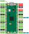

# Raspberry Pi Pico Oscilloscope

This repository contains firmware for Raspberry Pi Pico Oscillsocope.
Oscilloscope uses Data Plotter https://github.com/jirimaier/DataPlotter.

Compiled binary file can be foud here:
 - https://github.com/ela-project/rpi-pico-osc/releases

## Compilation
```bash
git submodule update --init
mkdir build
cd build
cmake ..
cmake --build .
```

## Pinout

